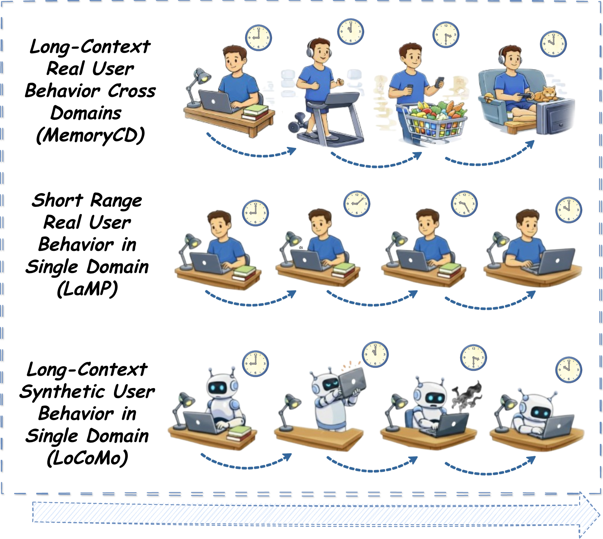
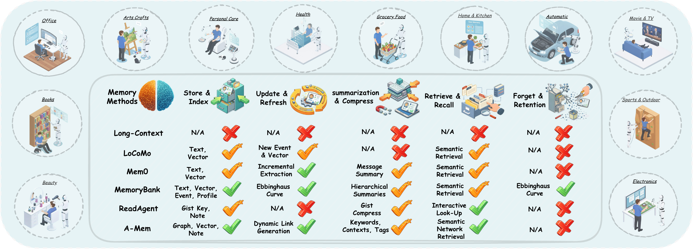

# MemoryCD

**MemoryCD: Benchmarking Long-Context User Memory of LLM Agents for Lifelong Cross-Domain Personalization**

A minimal evaluation harness for four personalization tasks across four Amazon-review
domains, in two settings (single-domain and cross-domain), with two memory-selection
methods (long-context and RAG/BM25).

## Comparison with existing memory benchmarks

<p align="center">
  
</p>

**MemoryCD (ours)** captures cross-domain real-user activities over long time horizons.
**LaMP** (Salemi et al., 2024) focuses only on short-term single-domain user behaviors.
**LoCoMo** (Maharana et al., 2024) represents non-authentic LLM-simulated user behaviors.

## Overview



**Figure 2.** The MemoryCD benchmark spans 12 real-world domains and evaluates 6 SOTA
memory methods. Different from other memory benchmarks that target one specific memory
stage (mostly retrieval), we design 4 basic tasks with 2 settings to provide end-to-end
user satisfaction evaluation grounded on lifelong real user behaviors.

## Setup

```bash
# Python 3.10+
pip install -r requirements.txt
# or
pip install -e .
```

Configure the LLM client (any OpenAI-compatible endpoint works):

```bash
# OpenAI
export OPENAI_API_KEY=...
# or OpenRouter
export OPENROUTER_API_KEY=...
export LLM_PROVIDER=openrouter
```

## Dataset

The unified cross-domain JSONL plus the per-domain metadata files are released on
Hugging Face:

> https://huggingface.co/datasets/WZDavid/MemoryCD

After downloading, place the files like this (or pass `--input` and `--meta-dir`
to point elsewhere):

```
data/cross_domain.jsonl
meta/meta_Beauty_and_Personal_Care.jsonl.gz
meta/meta_Books.jsonl.gz
meta/meta_Electronics.jsonl.gz
meta/meta_Home_and_Kitchen.jsonl.gz
```

Quick download with the Hugging Face CLI:

```bash
pip install -U huggingface_hub
huggingface-cli download WZDavid/MemoryCD --repo-type dataset --local-dir .
```

## Input data

Both evaluation scripts read a single **cross-domain JSONL** file. Each line is one user:

```json
{"user_id": "...", "interactions": {
    "Beauty_and_Personal_Care": [{"parent_asin": "...", "rating": 5, "title": "...",
                                  "text": "...", "timestamp": 1700000000,
                                  "negative_parent_asins": ["...", "..."]}],
    "Books": [...],
    "Electronics": [...],
    "Home_and_Kitchen": [...]
}}
```

Metadata files `meta_<Domain>.jsonl[.gz]` (one item per line, with `parent_asin`,
`title`, `average_rating`, `main_category`, optional `description`) should live in
`meta/` by default.

Required fields per interaction:
- `parent_asin`, `rating`, `title`, `text`, `timestamp`
- `negative_parent_asins` (only needed for `item_ranking`)

## Tasks and metrics

| Task                    | Output             | Metrics                                  |
|-------------------------|--------------------|------------------------------------------|
| `rating_prediction`     | integer 1–5        | MAE, RMSE                                |
| `review_summarization`  | short review title | ROUGE-1/L, BLEU-1/4, BERTScore           |
| `review_generation`     | full review body   | ROUGE-1/L, BLEU-1/4, BERTScore           |
| `item_ranking`          | ranked ASIN list   | NDCG@K, Recall@K (default K = 1, 3, 5)   |

## Methods

| `--method`     | Behavior                                            |
|----------------|-----------------------------------------------------|
| `long_context` | Keep most-recent N interactions by recency.         |
| `rag`          | BM25 retrieval over memory; top-K via `--max-memory-items`. Persistent disk cache under `cache/`. |

## Settings

### Single-domain (`evaluation_all_4task.py`)
Memory and test both come from the same domain. For each user, the last `--num-test`
interactions in `--domain` are the test set; earlier ones are the memory.

```bash
python evaluation_all_4task.py \
    --task rating_prediction \
    --domain Books \
    --input data/cross_domain.jsonl \
    --llm-model openai/gpt-5

python evaluation_all_4task.py \
    --task item_ranking \
    --domain Electronics \
    --input data/cross_domain.jsonl \
    --method rag --max-memory-items 10 \
    --k-values 1 3 5
```

### Cross-domain (`evaluation_all_4task_cross_domain.py`)
Memory comes from one or more **source** domains; test comes from a **target** domain.

```bash
# Default: memory = the 3 non-target domains
python evaluation_all_4task_cross_domain.py \
    --task rating_prediction \
    --target-domain Home_and_Kitchen \
    --input data/cross_domain.jsonl \
    --llm-model openai/gpt-5

# Subset of source domains
python evaluation_all_4task_cross_domain.py \
    --task review_summarization \
    --target-domain Home_and_Kitchen \
    --source-domains Books Electronics

# No-memory baseline
python evaluation_all_4task_cross_domain.py \
    --task rating_prediction \
    --target-domain Books \
    --no-memory
```

## Common flags

| Flag                 | Description                                                   |
|----------------------|---------------------------------------------------------------|
| `--task`             | One of the 4 tasks above.                                     |
| `--input`            | Path to the unified cross-domain JSONL.                       |
| `--meta-dir`         | Directory with `meta_<Domain>.jsonl[.gz]` (default `meta/`).  |
| `--llm-model`        | Model identifier for the OpenAI-compatible client.            |
| `--method`           | `long_context` (default) or `rag`.                            |
| `--max-memory-items` | Cap on memory items kept after selection.                     |
| `--num-test`         | Number of last interactions per user used as test (default 3).|
| `--max-users`        | Limit to first N users for quick smoke tests.                 |
| `--k-values`         | `--k-values 1 3 5` (item_ranking only).                       |
| `--log-dir`          | Output log directory (default `logs/single` or `logs/cross`). |

## Outputs

Each run writes:
- `logs/<setting>/<domain>/predictions_<run_id>.jsonl` — one entry per prediction
  with prompt, LLM response, prediction, ground truth, and per-prediction metrics.
- `logs/<setting>/<domain>/summary_<run_id>.json` — final aggregated metrics and
  RAG cache statistics (when applicable).

## Repository layout

```
api.py                                   LLM gateway client (OpenAI / OpenRouter)
eval_core.py                             Shared library: loaders, evaluators, predictor, prompts
evaluation_all_4task.py                  Single-domain entry point
evaluation_all_4task_cross_domain.py     Cross-domain entry point
methods/
  __init__.py
  base_method.py                         Abstract memory-selection interface
  long_context.py                        Recency-based selection
  rag.py                                 BM25 retrieval with persistent cache
run_evaluation_pa.sh                     Parallel driver — single domain
run_evaluation_cross_domain.sh           Parallel driver — cross domain
requirements.txt                         Pinned core dependencies
pyproject.toml                           PEP-621 manifest
```

## Citation

If you use MemoryCD in your research, please cite:

```bibtex
@article{zhang2026memorycd,
  title={Memorycd: Benchmarking long-context user memory of llm agents for lifelong cross-domain personalization},
  author={Zhang, Weizhi and Wei, Xiaokai and Huang, Wei-Chieh and Hui, Zheng and Wang, Chen and Gong, Michelle and Yu, Philip S},
  journal={arXiv preprint arXiv:2603.25973},
  year={2026}
}
```
